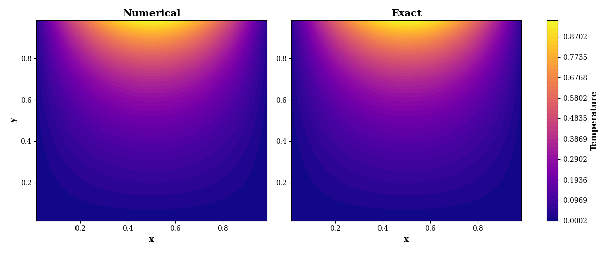
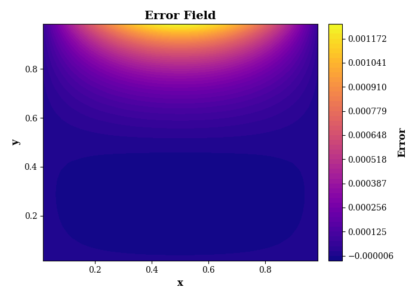
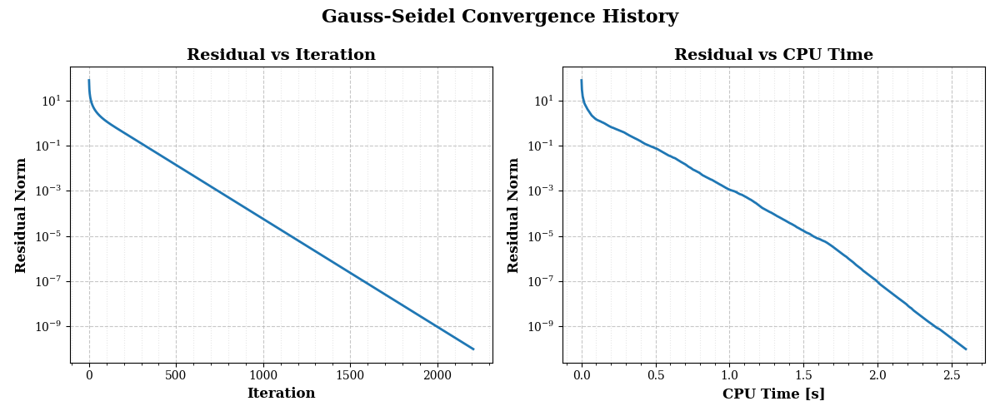
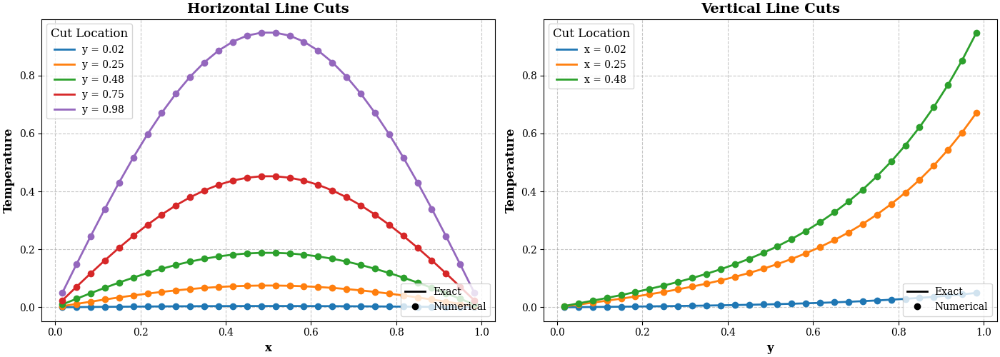

# CFD Project 01: Steady Two-Dimensional Heat Conduction

### A Second-Order Finite-Volume Solver using the Point Gauss-Seidel Method

## Overview

This project presents a numerical solution of the two-dimensional steady-state heat conduction (Laplace) equation on a square domain. The governing equation is discretized using a second-order cell-centered Finite Volume Method (FVM) and solved iteratively with the Point Gauss-Seidel algorithm.

The numerical implementation is verified by comparison with the analytical solution of the Laplace equation under prescribed Dirichlet boundary conditions. The repository contains the complete Python implementation, the full technical report written in LaTeX, and all figures used for verification and post-processing.

---

## Governing Equation

The physical problem is governed by the two-dimensional Laplace equation

$$
\nabla^2T=
\frac{\partial^2T}{\partial x^2}
+
\frac{\partial^2T}{\partial y^2}
=0
$$

subject to Dirichlet boundary conditions on all four boundaries of the computational domain.

For the selected boundary conditions, the analytical solution is

$$
T(x,y)=
\frac{\sin(\pi x)\sinh(\pi y)}
{\sinh(\pi)}.
$$

This analytical solution provides an exact reference for verification of the numerical solver.

---

## Numerical Method

The implementation consists of

* Cell-centered Finite Volume Method
* Structured Cartesian mesh
* Second-order spatial discretization
* Ghost-cell implementation of Dirichlet boundary conditions
* Point Gauss-Seidel iterative solver
* Residual monitoring using the L₂ norm

The residual norm used for convergence assessment is

$$
L_2=
\left(
\frac{1}{N_{CV}}
\sum_{i=1}^{N_{CV}}R_i^2
\right)^{1/2}.
$$

---

## Project Features

* Second-order accurate finite-volume discretization
* Modular Python implementation
* Analytical verification
* Residual convergence monitoring
* Error-field visualization
* Horizontal and vertical line-cut comparisons
* Clean LaTeX documentation
* Reproducible computational setup

---

## Results

### Temperature Distribution



The numerical solution shows excellent agreement with the analytical solution throughout the computational domain.

---

### Error Distribution



The numerical error remains small across the domain and exhibits the expected behavior of a second-order spatial discretization.

---

### Residual Convergence



The Point Gauss-Seidel solver converges monotonically until the prescribed residual tolerance is satisfied.

---

### Line-Cut Comparison



Horizontal and vertical line cuts demonstrate excellent agreement between the numerical and analytical solutions.

---

## Repository Structure

```text
CFD_Project_01_Heat_Conduction/

├── src/
│   └── CFD_Project_01_Heat_Conduction.py
│
├── report/
│   ├── CFD_Project_01_Report.pdf
│   └── latex/
│       ├── main.tex
│       ├── packages.tex
|       ├── system_info.json
│       └── sections/
│         ├── appendices/
|       └── figures/
│
└── README.md
```

---

## Requirements

* Python 3.x
* NumPy
* Matplotlib

Install the required packages using

```bash
pip install numpy matplotlib
```

---

## Verification

The numerical solution is verified by direct comparison with the analytical solution of the Laplace equation through

* contour plots,
* pointwise error fields,
* horizontal and vertical line cuts,
* residual convergence histories.

---

## Future Work

This project forms the first component of a larger Computational Fluid Dynamics portfolio. Future developments include

* Successive Over-Relaxation (SOR)
* Line Gauss-Seidel
* Alternating Direction Implicit (ADI)
* Multigrid acceleration
* Grid-convergence analysis
* Performance benchmarking
* Extension to the Poisson equation
* Applications to incompressible CFD solvers

---

## Report

The complete technical report is available in


[📄 CFD Project Report](report/CFD_Project_01_Heat_Conduction_Report.pdf)


and includes the mathematical derivation, numerical implementation, verification procedure, computational setup, and detailed discussion of the results.
